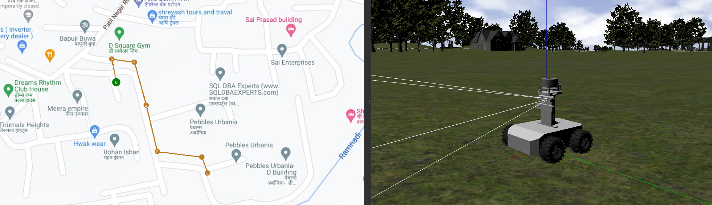
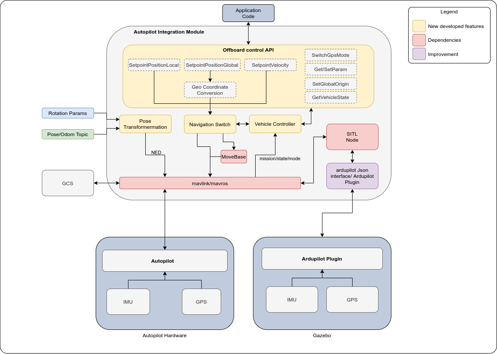

# autopilot-integration-module

 

## Overview

This repository contains the ROS stack for high level control and interfacing ROS based ground vehicles with an [mavlink](https://mavlink.io/en/about/overview.html) based Autopilot firmware e.g [Ardupilot](https://ardupilot.org/rover/index.html) and [PX4](https://px4.io/software/software-overview/).

## Architecture

 

### **Why Autopilot-Integration-Module?**

  Purpose of Autopilot-Integration-Module is to provide following functionality for outdoor ground vehicles which speedups outdoor vehicle application development:

**1. Autopilot Configuration:**
  Configures Basic airframe, output channels, rc channels and other peripherals of autopilot for the Robot application

**2. Offboard Control API:**
  Offboard control api is implemented as rosservice to send Setpoint(PostionLocal/PositionGlobal/Velocity) commands to Autopilot. These services gives option to choose between Autopilot navigation and ROS navigation (movebase).

**3. Transformation node:**
  Ardupilot/ PX4 Autopilot uses FRD (X Forward, Y Right, Z Down) frame for the local body frame as well as for reference frame. When using heading of the compass, the Autopilot reference frame x-axis will be aligned with north, therefore it is also known as NED (X North, Y East, Z Down). The heading of the reference frame of the Autopilot estimator and the external pose estimator will not match directly.
  Depending upon the tf of source frame of the external pose w.r.t. robot base link, we need to apply a custom transformation to external pose estimation before sending to Autopilot in order to match with Autopilot body frame in NED.

**4. Integrates external planners for navigation**

**5. GPS Switch:**
  This enables or disables autopilot GPS. In non-GPS mode external position estimation is used to calculate autopilot state.

**6. Navigation switch to change between Autopilot and ros planners:**
 This switch is useful when there's a need for precise navigation with avoidance in a constrained environment. Navigation method could be changed whenever needed.

**7. Navigate through GPS waypoint using ROS planner:**
  SetpointPositionGlobal service converts GPS coordinates to local coordinate further it is sent movebase for local navigation.

**8. Autopilot (global/local) waypoint mission execution with ROS or Autopilot planners**

**9. Simulation Support:**
  This package can be used with [Ardupilot SITL](https://ardupilot.org/dev/docs/using-gazebo-simulator-with-sitl.html) to simulate autopilot mission or waypoint navigation. This provides improved ardupilot plugin to support ground vehicle simulation on gazebo and SITL. Also provides a ardupilot JSON interface to be able to integrate with simulators other than gazebo.


______________________________________________

## Installation

**Package Installation** 

On ROS2 Foxy

```bash
cd <your_colcon_ws>/src
git clone https://github.com/TechnoYantra/ros2-autopilot-integration-module.git
cd ..
colcon build --symlink-install
```

- Install Dependancies

  - ```bash
    # Navigation stack 2
    sudo apt-get install ros-foxy-nav2-*
    # tf
    sudo apt-get install ros-foxy-tf-transformations
    # mavros
    sudo apt-get install ros-foxy-mavros ros-foxy-mavros-extras
    ```

**ROS1 Bridge **

Build and install ros1 bridge from source https://github.com/ros2/ros1_bridge#building-the-bridge-from-source

**MAVROS Installation**

- On ROS1 Noetic

```bash
sudo apt-get install ros-noetic-mavros ros-noetic-mavros-extras -y
wget https://raw.githubusercontent.com/mavlink/mavros/master/mavros/scripts/install_geographiclib_datasets.sh
chmod +x install_geographiclib_datasets.sh 
sudo ./install_geographiclib_datasets.sh
sudo apt-get install python3-pip
pip3 install pymavlink
```

- clone mavros_node pkg ros1 workspace

```bash
cd <your_catkin_ws>/src
git clone https://github.com/TechnoYantra/mavros_node.git
```

**Ardupilot Firmware Installation**

```bash
git clone https://github.com/TechnoYantra/ardupilot.git
cd ardupilot
git submodule update --init --recursive
Tools/environment_install/install-prereqs-ubuntu.sh -y
. ~/.profile
echo "export PATH=$PATH:$HOME/ardupilot/Tools/autotest" >> ~/.bashrc
echo "export PATH=/usr/lib/ccache:$PATH" >> ~/.bashrc
source ~/.bashrc
```

**Ground Control Application**

[Download from here](https://docs.qgroundcontrol.com/master/en/getting_started/download_and_install.html#ubuntu)

## Configuration

**Configure package**

Open config file ty_autopilot_core/config/autopilot_integrator.yaml and edit parameters as described below.

```yaml
ty_autopilot_core_node:
  ros__parameters:
    use_sim_time: false
    framework_type: "ARDUPILOT" # options: ARDUPILOT / PX4
    framework_vesion: 4.1.0
    airframe_class: 1 # ROVER
    airframe_type: 0 # Undefined used for SKID_STEER/ diffrential drive
    
    autopilot_param_config_file: /home/<user_name>/<your_colcon_ws>/src/ros2-autopilot-integration-module/ty_autopilot_core/config/autopilot_param.yaml
    
    autopilot_ros_config:
      twist_mux_topics:
          ext_nav: /nav_cmd_vel # External Navigation / move_base topic
          key_teleop: /key/cmd_vel # Keyboard teleop topic
          sp_vel: /sp_vel/cmd_vel

      ext_pose_estimation:
      #################################################################################
      # Frame transformer transforms the pose of source_frame to target_frame, 
      # then it rotates the frame to match body_frame according ENU convention with
      # the param orientation.x (roll), orientation.y (pitch), orientation.z (yaw) and 
      # source_frame_orinetation.z (world yaw).
      #################################################################################
        enable: False
        use_odom: True ## if false use ext_pose_topic
        odometry:
          use_tf: False
          topic: "/camera/odom/sample"
          stemped: False
          covarience: False
          source_frame: "cam_odom_frame"
          target_frame: "cam_link"
          frame_pose:  # Position and orientation of odometry frame
            position:
              x: 0.0
              y: 0.0
              z: 0.0
            orientation:
              x: 0.0
              y: 0.0
              z: 1.576
          source_frame_orinetation:  
          #################################################################################
          # rotation to be applied to source frame wrt world frame for t265 camera use 
          # z = 1.576
          #################################################################################
            x: 0.0
            y: 0.0
            z: 0.0
        pose: 
          topic: "/camera/pose/sample" 
          frame_pose:
            position:
              x: 0.0
              y: 0.0
              z: 0.0
            orientation:
              x: 0.0
              y: 0.0
              z: 1.57
```

ty_autopilot_core/config/autopilot_param.yaml

```yaml
output_channel_config: 
    #################################################################################
    # Assign servo channel functions to SERVOx_FUNCTION parameter
    #https://ardupilot.org/rover/docs/parameters.html#servo1-function-servo-output-function
    #################################################################################
      SERVO1_FUNCTION: 73 # Throttle Left
      SERVO3_FUNCTION: 74 # Throttle Right

auxilary_channel_config:
#################################################################################
# Assign auxiliary functions to RCx_OPTION where x is RC channel number
# Refer https://ardupilot.org/rover/docs/parameters.html#rc1-option-rc-input-option for more.
#################################################################################
  RC6_OPTION: 90 # EKF Pose Source
  RC7_OPTION: 65 # GPS Disable

ek3_sources_config:
#################################################################################
# Assign ek3 position sourcees
# Refer https://ardupilot.org/copter/docs/parameters.html#ek3-src-parameters for more.
#################################################################################
  EK3_SRC1_POSXY: 3.000000
  EK3_SRC1_POSZ:  1.000000
  EK3_SRC1_VELXY: 3.000000
  EK3_SRC1_VELZ:  3.000000
  EK3_SRC1_YAW:   1.000000

  EK3_SRC2_POSXY: 6.000000
  EK3_SRC2_POSZ:  1.000000
  EK3_SRC2_VELXY: 6.000000
  EK3_SRC2_VELZ:  6.000000
  EK3_SRC2_YAW:   6.000000
```


## Simulation Setup

**Simulation Support**

  This package can be used with [Ardupilot SITL](https://ardupilot.org/dev/docs/using-gazebo-simulator-with-sitl.html) to simulate autopilot mission or waypoint navigation. We have improvised a [ardupilot plugin](https://github.com/TechnoYantra/autopilot-integration-module/tree/main/ardupilot_json_interface) which is responsible for interfacing gazebo with SITL to support twist msgs in order to use differential/ skid steer drive robots, previously this plugin had limited support for the ground vehicle as this plugin was intend to use for UAV simulation now we can use this efficiently for ground vehicles. 

​	Also we have added ardupilot JSON interface node which runs gazebo independent, this is useful if need to use other physics simulators.

**Robot Model Setup**

- Attach ardupilot plugin xacro file to your robot and set parent of this plugin as base_link of your robot also link the joints of your robot to the joints of plugin macro

```xml
<xacro:include filename="$(find ardupilot_json_interface)/gazebo/autopilot.gazebo"/>
.
.
.
<xacro:ty_ardupilot parent="base_link" instance="1" wheel_fr_joint="joint_wheel_fr" wheel_fl_joint="joint_wheel_fl" wheel_br_joint="joint_wheel_br" wheel_bl_joint="joint_wheel_br" >
  <origin rpy="0 0 0" xyz="0 0 0.0" />
</xacro:ty_ardupilot>
```

**Gazebo world Physics Setup**

* Copy the following "physics" and "scene" (Optional) block to your world file

```xml
<scene>
    <ambient>0.0 0.0 0.0 1.0</ambient>
    <shadows>0</shadows>
    <sky>
        <clouds>
            <speed>12</speed>
        </clouds>
    </sky>
</scene>

<physics name='default_physics' default='0' type='ode'>
    <gravity>0 0 -9.8066</gravity>
    <ode>
        <solver>
            <type>world</type>
            <iters>50</iters>
            <sor>1.3</sor>
            <use_dynamic_moi_rescaling>1</use_dynamic_moi_rescaling>
        </solver>
    </ode>
    <max_step_size>0.01</max_step_size>
    <real_time_factor>1</real_time_factor>
    <real_time_update_rate>250</real_time_update_rate>
    <magnetic_field>6.0e-6 2.3e-5 -4.2e-5</magnetic_field>
</physics>
```

## Usage

**Launch Vehicle controller**

```bash
source /opt/ros/foxy/setup.bash
source <your_colcon_ws>/install/setup.bash
ros2 launch ty_autopilot_core ty_autopilot_vehicle_control.launch.py
```

**Launch SITL**

```bash
#################################################################################
# Use gazebo-rover 
#################################################################################
export PARAM_FILE=<path_to_your>/<param_file>.param
sim_vehicle.py -v APMrover2 -f gazebo-rover --wipe-eeprom --add-param-file=$PARAM_FILE -m --mav10 --map --console -I1

# OR
# edit path of param file in sitl.sh available in dir "ty_autopilot_core/script" and launch the script 

# OR
#################################################################################
# Use JSON Interface 
# Note: Some bugs in sim_vehicle.py for this interface, causes non consistent mavros connection, need to load parameters after sitl launch via mavproxy cli
#################################################################################
sim_vehicle.py -v APMrover2 -f JSON 127.0.0.1 -m --mav10 --map --console --out=udp:127.0.0.1:14550 --out=tcpin:127.0.0.1:8100 --mavproxy-args="--streamrate=50"
```

**Launch Mavros (ROS1)**

```bash
source /opt/ros/noetic/setup.bash
source <your_colcon_ws>/devel/setup.bash
roslaunch mavros_node mavros.launch
```

**Launch ROS1 bridge**

```bash
source /opt/ros/noetic/setup.bash
source /opt/ros/foxy/setup.bash
source /home/chirag/ros1_bridge_ws/install/setup.bash
export ROS_MASTER_URI=http://localhost:11311
ros2 run ros1_bridge dynamic_bridge --bridge-all-1to2-topics
```


**Features and options**

- Switch GPS ON/OFF

```bash
#################################################################################
# Turn On GPS 
#################################################################################
ros2 param set /ty_autopilot_core_node disable_gps false

#################################################################################
# Turn Off GPS 
#################################################################################
ros2 param set /ty_autopilot_core_node disable_gps true
```

- Change EKF3 Navigation source

```bash
# refer https://ardupilot.org/rover/docs/parameters.html#ek3-src-parameters for full parameter reference
#################################################################################
# Source 1 (GPS)
# EK3_SRC1_POSXY   3.000000
# EK3_SRC1_POSZ    1.000000
# EK3_SRC1_VELXY   3.000000
# EK3_SRC1_VELZ    3.000000
# EK3_SRC1_YAW     1.000000
#################################################################################
ros2 param set /ty_autopilot_core_node mav_pose_source 1

#################################################################################
# Source 2 (External Estimation)
# EK3_SRC2_POSXY   6.000000
# EK3_SRC2_POSZ    1.000000
# EK3_SRC2_VELXY   6.000000
# EK3_SRC2_VELZ    6.000000
# EK3_SRC2_YAW     1.000000
#################################################################################
ros2 param set /ty_autopilot_core_node mav_pose_source 2

#################################################################################
# Source 3 ( Not Used )
# EK3_SRC3_POSXY   0.000000
# EK3_SRC3_POSZ    1.000000
# EK3_SRC3_VELXY   0.000000
# EK3_SRC3_VELZ    0.000000
# EK3_SRC3_YAW     0.000000
#################################################################################
ros2 param set /ty_autopilot_core_node mav_pose_source 3
```

**Navigation Methods**

- Setpoint Velocity

```bash
ros2 service call /ty_autopilot/set_velocity ty_autopilot_msgs/srv/SetVelocity "{vx: 2.0, vy: 0.0, vz: 0.0, yaw_rate: 0.0, command_life: 0.0, auto_arm: True}"
```

- Setpoint Position Local

```bash
ros2 service call /ty_autopilot/set_position_local ty_autopilot_msgs/srv/SetPositionLocal "{frame_id: 'map', x: 10.0, y: 5.0, z: 0.0, heading: 0.0, auto_arm: True, use_ros_planner: False}"
```

- Setpoint Position Global

```bash
ros2 service call /ty_autopilot/set_position_global ty_autopilot_msgs/srv/SetPositionGlobal "{frame_id: 'world', x: -35.36296487, y: 149.16523124, z: 0.0, heading: 0.0, auto_arm: True, use_ros_planner: False}"
```

- Set EKF Origin

```bash
ros2 service call /ty_autopilot/set_ekf_origin ty_autopilot_msgs/srv/SetEkfOrigin "{}"
```

- Get Telemetry Status

```bash
ros2 service call /ty_autopilot/get_vehicle_state ty_autopilot_msgs/srv/GetVehicleState "{frame_id: 'map'}"
```

## Upcoming Additions
* ros2 support
* support for Px4 firmware
* support for px4-message along side mavlink message  
* Web UI
